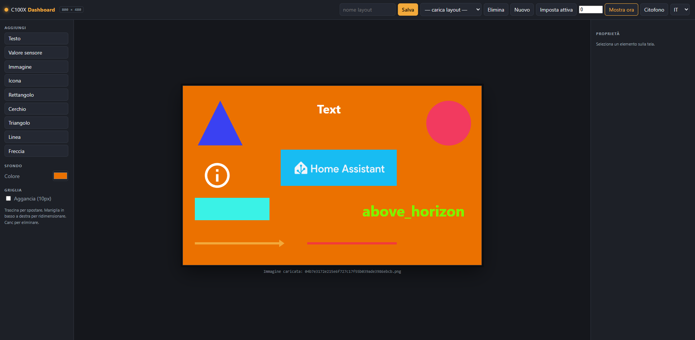

<p align="center"></p>

# C100X Dashboard

> L'integrazione include la propria icona in `custom_components/c100x_dashboard/brand/` (Home Assistant 2026.3+).

Componi schermate personalizzate per un videocitofono **BTicino Classe 100X** e mostrale sul suo
display da **Home Assistant**, con i valori dei sensori aggiornati dal vivo. Le schermate si
creano trascinando elementi su una tela 800×480 in un editor web; il citofono mostra la schermata
attiva e ne aggiorna i valori ogni secondo.

> 🇬🇧 [Read in English](README.md)



> **Nota sulla paternità del progetto.** Circa il **99% di questo progetto è stato scritto da
> Claude** (l'IA di Anthropic), a partire da obiettivi, test e riscontri sul dispositivo forniti
> dal proprietario della repo. Il proprietario ha guidato il design, provato tutto su hardware
> reale e validato ogni passo; il codice, il QML, l'add-on e l'integrazione sono opera di Claude.

## Cosa contiene

- **Add-on** (`c100x_dashboard/`) — add-on di Home Assistant che è insieme l'**editor** (interfaccia
  web) e il **server** che il citofono interroga. Legge i valori delle entità da HA e serve la
  schermata attiva, le immagini e le icone via HTTP.
- **Lato citofono** (`c100x_dashboard/citofono/`) — `SchedaPage.qml`, il renderer che gira sul
  citofono, e gli script di patch. Installabile in automatico dall'add-on via SSH.
- **Integrazione** (`custom_components/c100x_dashboard/`) — integrazione opzionale di Home Assistant
  che aggiunge i servizi (`show`, `hide`, `set_active`) per richiamare le schede per nome dalle
  automazioni.

## Come funziona

```
Editor (add-on) ──salva──> layout schermate (JSON)
                                │
automazione HA / Node-RED ─show─> add-on ──GET /active──> citofono (polling ~1s)
                                   │                          │
                                   └─ legge i valori da HA ───┘ valori aggiornati dal vivo
```

Il citofono interroga `http://<add-on>:8099/active` ogni secondo. Quando "mostri" una schermata,
il citofono si accende e la visualizza; i valori si aggiornano mentre resta a video. Puoi
nasconderla a comando (utile per "mostra durante un blackout, nascondi quando torna la corrente").

## Prerequisiti

- Un BTicino **Classe 100X** con accesso SSH e il controller della community
  ([fquinto/bticinoClasse300x](https://github.com/fquinto/bticinoClasse300x) / [slyoldfox/c300x-controller](https://github.com/slyoldfox/c300x-controller)).
- **Home Assistant** con Supervisor (Home Assistant OS o Supervised), necessario per gli add-on.
- Citofono e HA sulla stessa LAN; il citofono deve raggiungere HA via **HTTP**.
- Node.js presente sul citofono (incluso nel setup del controller) per la patch QML.

## Installare l'add-on

**Come add-on locale (più semplice):**

1. Copia la cartella `c100x_dashboard/` nella cartella `/addons/` di Home Assistant
   (tramite gli add-on *Samba*, *SSH & Web Terminal* o *Studio Code Server*).
2. Impostazioni → Add-on → Store → ⋮ → **Check for updates**. Compare sotto *Local add-ons*.
3. Aprilo → **Installa** (la prima build scarica anche le icone MDI), poi **Avvia**.
4. L'editor compare nella barra laterale di HA (Ingress). È anche su `http://IP_HA:8099/`.

**Come add-on repository (un clic per altri):** pubblica questa repo su GitHub, poi in HA aggiungi
l'URL della repo in Store → ⋮ → *Repositories*.

## Usare l'editor

1. Aggiungi gli elementi dalla palette (testo, valore sensore, immagine, icona, forme, linea, freccia).
2. Per un valore sensore, cerca l'entità (autocomplete) — c'è l'anteprima dal vivo.
3. Dai un nome al layout e **Salva**.
4. Premi **Mostra ora** (con una durata) per visualizzarlo subito sul citofono.

Trascina per spostare, usa la maniglia in basso a destra per ridimensionare e quella tonda in alto
per ruotare. Le guide di allineamento agganciano gli elementi tra loro e al centro dello schermo.

## Installare sul citofono

Premi **Citofono** nell'editor, inserisci host/utente/password SSH del citofono e l'**URL
dell'add-on come lo vede il citofono** (es. `http://192.168.1.10:8099`), poi
**Installa / aggiorna**. L'add-on carica `SchedaPage.qml`, applica la patch a `main.qml`
(con backup) e riavvia. Una spunta decide se salvare la password SSH nell'add-on o chiederla ogni volta.

Preferisci l'installazione manuale? Vedi `c100x_dashboard/citofono/README.md`.

## Installare l'integrazione (opzionale)

L'integrazione è **separata dall'add-on** e **non viene installata in automatico** — l'add-on non
può scrivere nella cartella `custom_components/` di HA. Ti serve solo se vuoi i comodi servizi
`show` / `hide` / `set_active` nelle automazioni; senza, puoi comunque comandare l'add-on via REST
(vedi sotto).

1. Copia `custom_components/c100x_dashboard/` nella cartella `config/custom_components/` di HA
   (oppure aggiungi questa repo a HACS come *integration*).
2. Riavvia Home Assistant.
3. Impostazioni → Dispositivi e servizi → **Aggiungi integrazione → C100X Dashboard** e indica
   l'URL dell'add-on (es. `http://192.168.1.10:8099`).

## Richiamare le schede da Home Assistant

**Con l'integrazione.** Una volta installata (vedi sopra), ottieni queste azioni:

```yaml
# Mostra una schermata per nome, resta finché non la nascondi
action: c100x_dashboard.show
data:
  name: consumi
  duration: 0

# Nascondi ciò che è a schermo
action: c100x_dashboard.hide

# Imposta solo la schermata attiva (senza mostrarla)
action: c100x_dashboard.set_active
data:
  name: consumi
```

**Senza integrazione (REST).** L'add-on è un piccolo server REST: bastano due chiamate da Node-RED
(nodi `http request`) o da `rest_command` di HA:

```yaml
rest_command:
  citofono_mostra:
    url: "http://192.168.1.10:8099/api/show"
    method: POST
    content_type: "application/json"
    payload: '{"name":"{{ name }}","duration":{{ duration | default(0) }}}'
  citofono_nascondi:
    url: "http://192.168.1.10:8099/api/hide"
    method: POST
```

## Note e limiti

- La porta 8099 è esposta sulla LAN senza autenticazione (il citofono deve raggiungerla). Su rete
  domestica è accettabile.
- Il display del citofono ha una gamma colori limitata: grafiche piatte, icone e forme rendono
  benissimo; le foto possono virare di colore.
- Sono supportate solo le icone MDI (set incluso in HA); i pacchetti icone custom non vengono serviti.
- La password SSH, se salvata, è memorizzata in chiaro in `/data` dell'add-on e non viene mai
  restituita al browser.

## Crediti

Questo progetto si appoggia al lavoro di reverse engineering fatto prima dalla community dei citofoni BTicino:

- [slyoldfox/c300x-controller](https://github.com/slyoldfox/c300x-controller) — il controller che gira sul citofono e su cui questo progetto si basa (runtime Node, endpoint HTTP, ponte verso Home Assistant).
- [slyoldfox/c300x-dashboard](https://github.com/slyoldfox/c300x-dashboard) — l'ispirazione: una dashboard QML alimentata dal controller, pensata per il C300X (Qt 4.8.7 / QtQuick 1.x). Dato che dichiara *"Bticino c100x devices are untested"* e usa una generazione Qt/QtQuick diversa, il renderer di questo progetto è stato riscritto da zero per il C100X (Qt5 / QtQuick 2.x).
- [fquinto/bticinoClasse300x](https://github.com/fquinto/bticinoClasse300x) — il firmware modificato che rende possibile l'accesso root/SSH.

## Licenza

MIT — vedi `LICENSE`.
